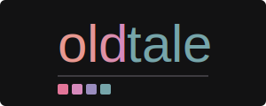
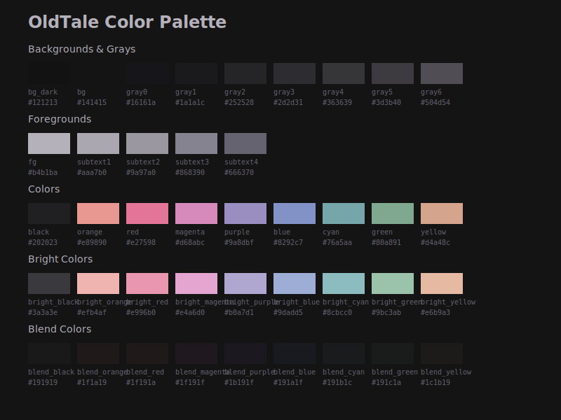
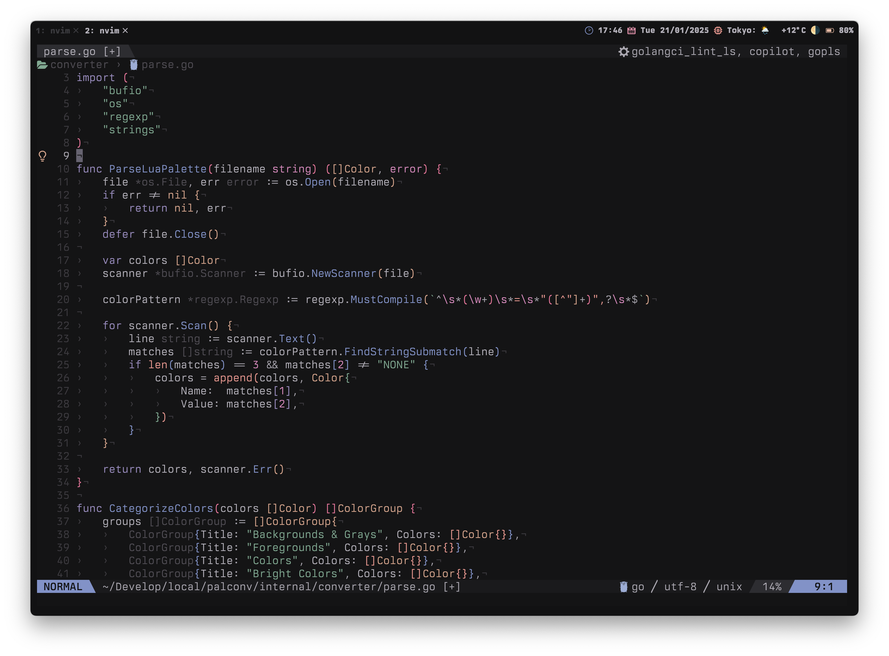

# oldtale.nvim



oldtale is a Neovim colorscheme focused on visual comfort, inspired by [OldWorld.nvim](https://github.com/dgox16/oldworld.nvim), with subtle adjustments tailored to personal preferences. While maintaining the gentle color palette of [OldWorld.nvim](https://github.com/dgox16/oldworld.nvim), it slightly increases the contrast to enhance readability and eye comfort, without sacrificing the soothing nature of the theme. Additionally, oldtale inherits the essence of [mellow.nvim](https://github.com/mellow-theme/mellow.nvim), while making fine-tuned adjustments to syntax highlighting and UI elements.

The reason for creating this new theme is that, although I deeply appreciated the visual comfort provided by [OldWorld.nvim](https://github.com/dgox16/oldworld.nvim), I wanted to make small adjustments to better suit my personal preferences, especially in terms of syntax highlighting and UI elements.

## 🎨 Palette



## 📷 Preview



## 📦 Installation

With [lazy.nvim](https://github.com/folke/lazy.nvim):

```lua
{
    "topazape/oldtale.nvim",
    lazy = false,
    priority = 1000,
}
```

## 🚀 Usage

Using lua:

```lua
vim.cmd.colorscheme("oldtale")
```

## ⚙️ Configuration

The theme comes with sensible defaults, but you can customize it to your liking:

```lua
local default_config = {
	terminal_colors = true,
	styles = {
		comments = {},
		keywords = {},
		identifiers = {},
		functions = {},
		variables = {},
		booleans = {},
	},
	integrations = {
		blink = false,
		cmp = false,
		gitsigns = false,
		lazy = false,
		lsp = false,
		markdown = false,
		mason = false,
		noice = false,
		notify = false,
		rainbow_delimiters = false,
		saga = false,
		telescope = false,
		treesitter = false,
	},
	highlight_overrides = {},
}
```

> [!Note]
> All plugin integrations are disabled by default. Make sure to enable the integrations you want to use in your configuration.

To customize the theme, pass your configuration like this:

```lua
require("oldtale").setup({
	styles = {
		booleans = { italic = true, bold = true },
	},
	integrations = {
		blink = true,
		telescope = true,
	},
	highlight_overrides = {
		Comment = { bg = "#ff0000" },
	},
})
```

## 🔥 Contributing

Contributions are welcome! Feel free to open issues or submit PRs for any improvements you'd like to see.

## 🎙️ Acknowledgements

- [oldworld.nvim](https://github.com/dgox16/oldworld.nvim) for providing an excellent base theme that prioritizes eye comfort
- [mellow.nvim](https://github.com/mellow-theme/mellow.nvim) for the original inspiration and color philosophy

This theme builds upon the great work done by both [oldworld.nvim](https://github.com/dgox16/oldworld.nvim) and [mellow.nvim](https://github.com/mellow-theme/mellow.nvim), aiming to provide another option for developers who prioritize comfortable viewing during long coding sessions.
